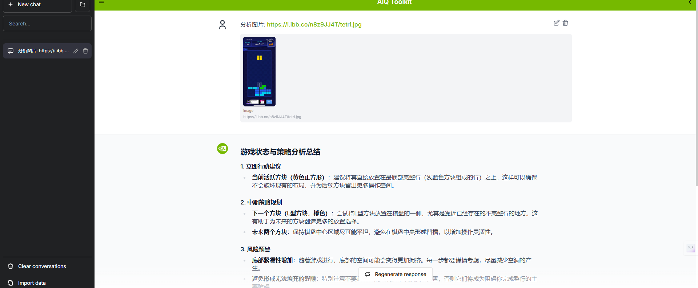
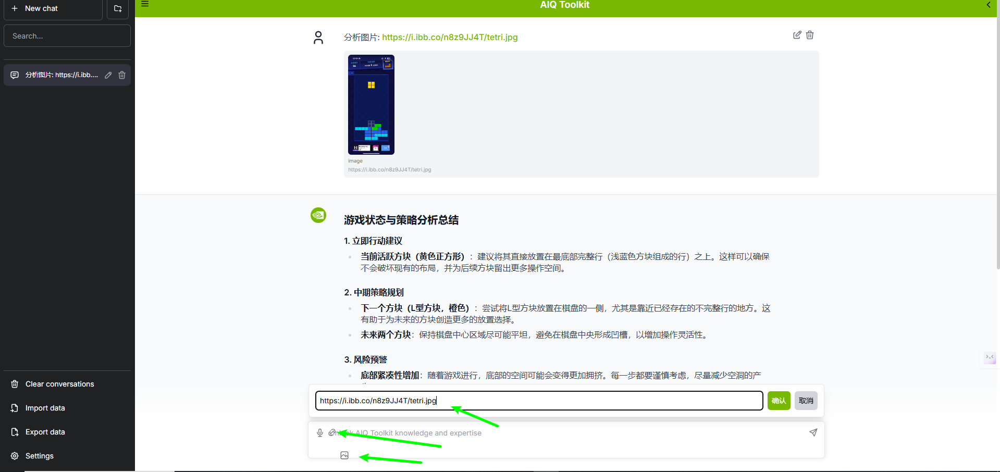

# NVIDIA NeMo Agent Toolkit 融合多模态视觉理解与策略推理

> 🏆 **黑客松项目** - 基于NVIDIA NeMo Agent Toolkit构建的智能俄罗斯方块分析系统，融合多模态视觉理解与策略推理



## 🎯 项目简介

本项目是基于**NVIDIA NeMo Agent Toolkit**开发的俄罗斯方块智能分析系统，专门针对游戏场景进行深度优化。系统通过先进的**多模态视觉语言模型**实时解析游戏截图，提供专业的游戏状态分析和策略建议。

基于 https://github.com/HeKun-NVIDIA/hackathon_aiqtoolkit 开源项目，

这里默认已经配置好环境。

### 一、前端UI层实现方案

**修改目标：** 在现有聊天界面基础上增强图片处理能力，支持俄罗斯方块游戏截图上传和分析

**核心修改文件：**

1. **ChatInput.tsx** - 增强输入组件
   - 添加图片上传按钮和拖拽区域
   - 支持常见图片格式（jpg, jpeg, png, webp）
   - 实现图片预览和删除功能
2. **ChatMessage.tsx** - 增强消息显示
   - 添加图片消息类型渲染
   - 支持游戏截图缩略图显示
   - 添加分析状态指示器
3. **Chat.tsx** - 主聊天逻辑
   - 集成图片上传API调用
   - 管理分析状态和结果显示

**技术实现要点：**

- 使用React Hook管理图片状态
- 实现文件类型验证和大小限制
- 添加加载状态和错误处理
- 保持与现有消息系统的兼容性

### 二、后端工具层实现方案

**新增工具模块：**

1. **image_description.py** - 视觉分析工具

   ```
   功能：俄罗斯方块游戏截图分析
   输入：图像文件或URL
   输出：结构化游戏状态信息
   处理流程：
     - 图像预处理和格式转换
     - 调用多模态LLM进行游戏状态识别
     - 提取关键信息（方块类型、布局、分数等）
     - 返回标准化分析结果
   ```

2. **tetris_strategy_analysis.py** - 策略分析工具

   ```
   功能：基于游戏状态提供策略建议
   输入：游戏状态描述（来自视觉分析或用户输入）
   输出：策略建议和操作指导
   分析维度：
     - 当前局势评估
     - 最佳放置位置推荐
     - 风险预警和机会识别
     - 具体操作步骤建议
   ```

**注册机制（register.py）：**

- 按照配置文件的`_type`字段注册工具
- 确保工具名称与配置一致
- 实现工具发现和加载机制

### 三、配置系统实现方案

**tetris_agent_config.yml 解析：**

1. **功能工具配置**
   - 视觉分析工具：绑定多模态LLM，支持指定图片格式
   - 策略分析工具：绑定策略LLM，专注文本分析

2. **LLM服务配置**
   - 多模态LLM：使用qwen-vl-max处理图像理解
   - 策略LLM：使用qwen-max生成策略建议
   - 统一的API密钥和端点配置

3. **工作流配置**
   - ReAct代理模式，支持工具链调用
   - 清晰的系统提示词定义处理流程
   - 完善的错误处理和重试机制

**启动流程：**

直接运行 start.sh


